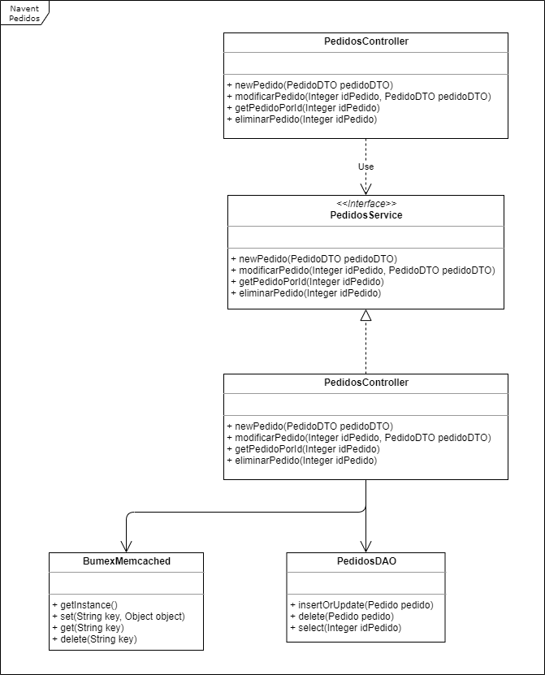

# navent-pedidos

# Punto 1
Implementado usando:
* Java 8
* Spring Framework

Diagrama de clases:

# Punto 2
Al usar Hibernate se pueden mapear los LOB a java.sql.Clob o a java.sql.Blob
Estos tipos de dato permiten al driver JDBC a usar optimizaciones especificas de LOB, que permiten optimizar la performance de la aplicacion.
Otro punto es el lazy loading. Generalmente se requiere mucha memoria para obtener los LOB de forma eager. Seria bueno obtener unicamente el LOB si es realmente necesario para la logica de negocio.
La manera mas sencilla de cargar un LOB de forma lazy es guardandolos en tablas por separado, y mapear luego la entidad al LOB.

Segun la guia oficial de Oracle, hay varias formas de optimizar el uso de los LOBs. Por ejemplo:
* En lo posible leer/escribir grandes bloques de datos en una operacion
* Activar LOB Buffering para escribir/leer bloques de datos pequeños

# Punto 3
Resuelto dentro de src/main/resources/public
